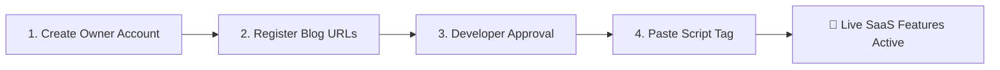

# 📖 Partial Existence SaaS Engine — User Integration Manual

Welcome to **Partial Existence**, a serverless, multi-tenant blog engagement and identity platform. This manual guides blog owners and developers on how to integrate verified user authentication, real-time likes, deduplicated pageview metrics, multi-language profanity moderation, and subtle attribution into any website in under **2 minutes**.

---

## 🌟 Key Features Overview

* 🔐 **Top-Right Authentication & Profile Avatar:** Drop-in Sign In pill and circular initials avatar with full login, account creation, and user management dialogs.
* 💬 **Verified Discussion Threads:** Discussion section requiring verified user login to prevent spam.
* 🛡️ **Automated Multi-Language Profanity Shield:** Built-in backend filter analyzing English, Hindi (Devanagari), Hinglish, and Tamil (Tamil script & Tanglish) with review-holding for borderline comments.
* ❤️ **Real-Time Deduplicated Interactions:** Device-fingerprinted pageview telemetry and likes.
* 🏷️ **Seamless Footer Watermark:** Subtle *"Maintained by Partial Existence Services"* attribution blended naturally into your site's existing footer.
* 🧹 **Zero Bloat & 100% Decoupled:** Powered entirely by a single `<script>` tag. Removing the script leaves your blog completely clean with zero leftover buttons or residual styles.

---

## 🚀 Quick-Start Integration Guide (4 Steps)



### Step 1: Create a Blog Owner Account
1. Visit the **Partial Existence SaaS Portal**:  
   🔗 [**https://partial-existence.pages.dev/**](https://partial-existence.pages.dev/)
2. On the right-hand **Blog Owner Account** card, select the **Create Account** tab.
3. Enter your **Display Name**, **Blog Owner Email**, and a secure **Password** (min 6 characters).
4. Click **Create Blog Owner Account →**.

---

### Step 2: Connect Your Blog & Register URLs
In the **Connect Blog Website** form on the left:

1. **Blog / Website Name (Optional):** e.g., *My Reflections Blog*
2. **Blog Website URL (Root / Home):**  
   *The base URL of your website where the top-right Sign In / Account Avatar bar will appear.*  
   *Example:* `https://username.github.io/my-blog/`
3. **Sample Blog Page URL (Single Post):**  
   *A URL pointing to any one published blog post. The SaaS engine auto-detects your article URL structure to map Likes, Views, and Comment sections.*  
   *Example:* `https://username.github.io/my-blog/posts/first-post`
4. Click **Submit & Request Developer Approval →**.

---

### Step 3: Developer Review & Anti-Bot Verification
To safeguard databases against automated bot overload, new blog registrations are reviewed by the developer (`dev.vinyas.one@gmail.com`):

* While under review, your blog status displays: `⏳ Pending Review`.
* Your custom embed script tag will remain locked until confirmation.
* Once confirmed by the developer, your status turns to `🟢 ✓ Approved`.

---

### Step 4: Add the Embed Script to Your Website
Once approved, copy your single-line `<script>` tag from the dashboard:

```html
<!-- Partial Existence SaaS Engine (Auth, Comments, Likes, Watermark) -->
<script src="https://partial-existence.pages.dev/embed.js" data-website-id="YOUR_WEBSITE_ID" async></script>
```

#### Where to Paste:
Paste this script tag into your blog's HTML template (e.g. `index.html`, `base.html`, `_app.jsx`, or `footer.php`) just before the closing `</body>` tag:

```html
<!DOCTYPE html>
<html lang="en">
<head>
  <meta charset="UTF-8">
  <title>My Blog</title>
</head>
<body>
  <div id="root">
    <!-- Your Blog Content -->
  </div>

  <!-- 👇 Partial Existence Embed Script -->
  <script src="https://partial-existence.pages.dev/embed.js" data-website-id="my-reflections" async></script>
</body>
</html>
```

That's it! Your website is now fully equipped with user accounts, interactions, and moderation.

---

## 🛠️ Blog Owner Moderation Dashboard

Blog owners can manage their community in real-time from [**https://partial-existence.pages.dev/**](https://partial-existence.pages.dev/):

### 1. Comment Moderation & Profanity Review
* **Published Comments:** View all active reflections posted across your blog posts.
* **Held for Review (Profanity):** Comments containing sensitive or vulgar words across English, Hindi, Hinglish, or Tamil are automatically flagged and hidden from public visitors.
* **Action Buttons:**
  * `[✓ Approve & Publish]`: If a comment was flagged by a false positive, 1-click makes it visible to all readers.
  * `[🗑️ Delete Comment]`: Permanently erases the comment from the database.
  * `[🚫 Block User]`: Permanently bans the commenter from posting any future reflections on your blog.

### 2. Managing Blocked Users
* Blog owners can view their list of banned commenters and click `[Unblock]` to restore commenting privileges at any time.

### 3. Self-Service Account Deletion
* Blog owners and blog readers can delete their accounts anytime via the dashboard or via the embed avatar menu (`[Delete Account]`), ensuring privacy compliance.

---

## 💡 Removing or Toggling SaaS Features

The integration is **100% decoupled**:

* **To Disable SaaS:** Simply delete or comment out the `<script>` tag in your HTML. All UI elements (Sign In button, modal, comments, watermark) disappear immediately without breaking your layout.
* **To Re-enable SaaS:** Simply restore the `<script>` tag. All data and metrics will seamlessly resume.

---

## 📞 Support & Verification Inquiries

For approval requests or developer assistance:
* **Developer:** Vinyas
* **Email:** [dev.vinyas.one@gmail.com](mailto:dev.vinyas.one@gmail.com)
* **Portal:** [https://partial-existence.pages.dev/](https://partial-existence.pages.dev/)
