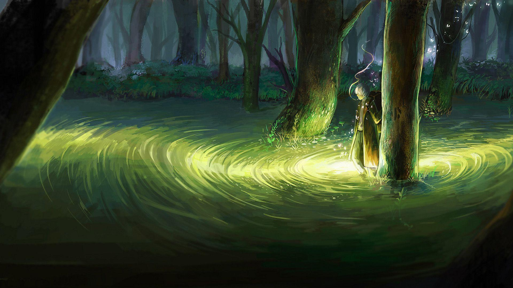
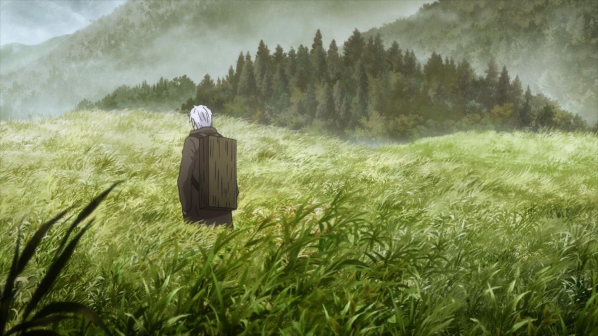
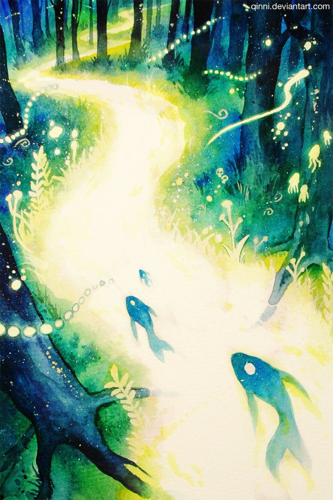

# Mushishi : The Haunting Calm

*Image Courtesy: Pinterest*

A show where almost nothing is solved, and that is exactly the point.

## The Haunting Calm

Most stories are built around conflict. Something is wrong, someone fixes it, the world resets.

Mushishi is not built that way.

It follows Ginko, a wandering "mushishi" — someone who studies and quietly manages mushi, primordial forms of life that exist alongside plants, animals, and humans but obey none of their rules. Mushi are not monsters. They are not metaphors for anything convenient. They are simply another kind of life that happens to brush up against ours, sometimes gently, sometimes at great cost.

Each episode is self-contained. A village, a family, a person carrying something they don't understand. Ginko arrives, observes, and — more often than the genre usually allows — does not fully fix anything. He explains. He adjusts. He leaves. The world continues, slightly altered, rarely at peace.

The haunting calm that is the theme of the show steals many intrests. As if something is being told in the silence of negative space.

## The World

*Image Courtesy: eye - Pinterest*

What Mushishi does better than almost anything else I've watched is treat coexistence as the actual subject, not the backdrop.

Mushi are never framed as good or evil. A mushi that steals a person's hearing, or grows a mountain range, or lives as light along a forest path, is not "wrong" for existing — it simply exists, and existing has consequences for whoever it touches. The show's tension almost always comes from that friction: two forms of life occupying the same space, neither one required to yield, both changed by the encounter anyway.

It is a quiet kind of storytelling. Long shots of grass moving in wind. Rivers that carry more than water. A protagonist who spends as much time walking between places as he does inside them. The show trusts silence the way most modern media trusts noise.

## The Practice

Ginko's method is almost procedural: watch first, understand the shape of the problem, intervene as little as the situation allows. He is not a hero clearing obstacles. He is closer to a careful observer who happens to carry the tools to help, and uses them sparingly.

That restraint is the thing I keep returning to. It's easy to write a character who fixes everything. It's much harder to write one who accepts that some things — grief, change, the simple fact that another form of life has needs too — are not problems to be solved, only conditions to be lived alongside.

There's a version of my own footer quote hiding in that idea: *to exist is to intrude, to not is to die.* Mushishi spends twenty-six episodes sitting inside that exact discomfort — the cost of simply being somewhere — without ever resolving it into something tidier than it actually is.

## Conclusion: What Mushishi Taught Me

Mushishi is not built for urgency, and I think that's the whole lesson.

It rewards the same instinct that makes a long walk more useful than a short scroll — the willingness to move slowly enough that you actually notice what's around you. Half the show's insight is just attention: sitting with a scene, a sound, a person's silence, long enough to understand what it's actually asking for.

Nothing in Mushishi is trying to be solved quickly. Nothing insists on being the center of the world. It's a show about learning to move through a space that was never only yours to begin with — and I think that's a harder, quieter kind of story than most series are willing to tell.
