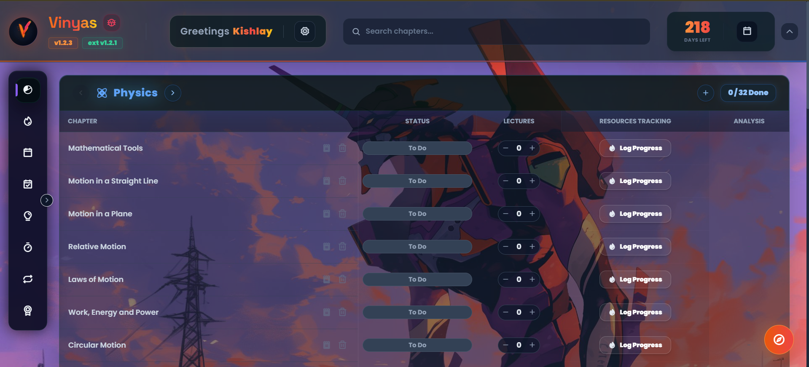

# What is Vinyas?

A study companion built from a problem I kept running into.

## Origin

Vinyas did not begin as an application.

It began as an Excel sheet.

The original problem was simple: keeping track of academic work, modules, assignments, and the small pieces of information that become surprisingly difficult to manage once there are enough of them. The spreadsheet solved the immediate problem, but it also made something obvious — if I was repeatedly maintaining a system by hand, perhaps the system itself could be made to do some of that work.

So the Excel sheet became a Python script.

The script became more capable.

And eventually, the script stopped feeling like a script and started becoming a project.

After my engineering entrance examinations came to a halt, I started building things that I once did and made Vinyas for myself. This is the first project of mine that is not a clone of any existing project and is made from scratch.

## The Application

Vinyas is a study companion designed around the idea that academic information should be useful rather than merely stored.

The project eventually evolved into a web application with a React Native read-only client, synchronization between the web application and the mobile side, assignment and module-oriented widgets, and a QR-based mechanism for connecting the app.
It consists of the following features:
- The web version comes with an extension that would scrape the quiz data and other material of study from a specific website that every engineering student has once opened in their life (PW). 
- When I was learning I had different problems regarding the records being mantained of lectures and their scores in one place and overall analysis of my attempts, from the record system that was first maintained in the excel sheet I advanced it to this.
- It consists of tracking of quizes, modules, assignments, pdfs and time bound practise module integrated in the web based extension that would also calculate and show you the "Master Score" on the basis of marks, progression, score etc.
- The mobile app, Vinyas Sathi is a read-only client of the web application and can be used to access the data synced from the web application.

## The Constraint

One of the most interesting constraints around Vinyas was also one of the simplest:

**₹0 infrastructure.**

The project was deliberately kept within free infrastructure where possible. That meant learning to think about resource limits instead of assuming that a backend has infinite database capacity, compute, or storage.

MongoDB Atlas was not just a database sitting behind the application. Its limitations became part of the engineering problem.

Instead of treating those limits as something to ignore, the application had to become more deliberate about what it stored and how often it stored it.

The engineering methods that solved this problem:
- **Data serialization and deserialization**: Instead of uploading each syllabus seperately I made a template that would load only the differences in the new data, this reduced heavy loads on database writing rewriting cycles. This made sure the application can handle 100s of users on 500 MB free MongoDB Atlas!
- **Debouncing**: Vercel serveless functions have limits with time, this was a problem as in these kind of websites that data is send frequently, to solve this I made sure that the data is sent in batches and not all at once, this reduced the number of write cycles and made the application more efficient. 
- **Personalized themes**: I introduced images to be as background themes that can be selected by the user, but saving an image on the little database was a problem, to solve this I introduced localStorage saving, that would save and render the image from browser, saving lots of space in the database.

...and more features you can read on my github. (Click the github icon below)

## Conclusion: What Vinyas Taught Me

Vinyas taught me things that tutorials rarely communicate directly.

Deploying an application changes how you think about it. A local project can be broken and restarted whenever necessary. A deployed application has users, state, updates, and consequences.

A database's free tier stops being an abstract number when your application actually depends on it.

A mobile application is not simply a smaller version of a web application.

A QR code can become part of an application's synchronization architecture rather than just a decorative feature.

Even deployment itself became part of the project. Vinyas uses Vercel for the web side, Expo tooling for the Android application, and OTA updates to make mobile releases easier to manage.

The project became less about learning individual technologies and more about understanding how those technologies behave when they have to coexist.

The proudest thing for me in it is it is used by someone else too :)

And finally test it yourself: [Vinyas](https://vinyas-one.vercel.app "Kind of not works on VIT Wifi :(") (Make sure you are not connected to an institution wifi, beacuse test servers like *.vercel.app gets blocked by FortiGuard.)